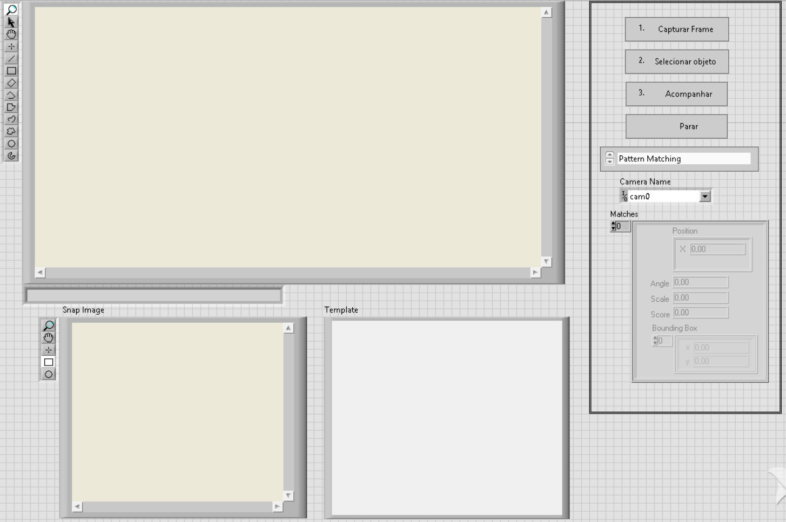
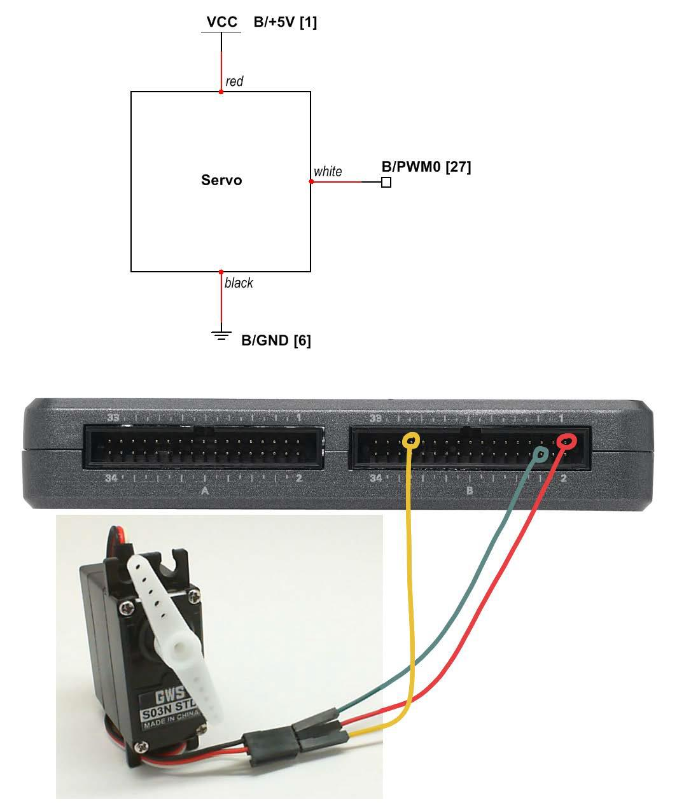
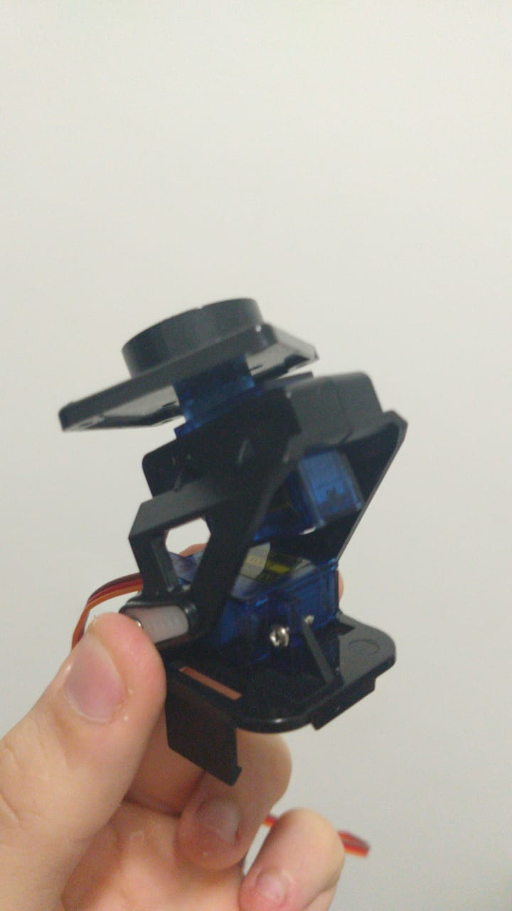

# Descrição: Programa em labview para controlar um sistema de monitoramento.

# Motivação:

Suprir a necessidade de monitorar desde a atividade de fábricas para controle de segurança e garantia de bom funcionamento a outros inúmeros sistemas que possuam alvos não fixos que precisem de monitoramento.

# Função:

Labview será utilizado para controlar o NI myRIO. Uma webcam conectada ao computador realizará a captura da imagem, onde, ao detectar mudança na posição do objeto desejado em relação ao centro da câmera, o myRIO acionará os servos motores para rotacionar a webcam(em pan e tilt) e continuar capturando a imagem do objeto de maneira centralizada.

# Interface e utilização:

O esboço da interface é o seguinte:
  

Para a utilização:  
Passos:  
1º - Conectar o servo motor de "pan" na parte A e o servo motor de "tilt" na parte B, de acordo com a ilustração:
  
2º - Rodar as VIs servos.vi e Object Tracking V2.vi.  
3º - Clicar em Capturar frame.  
4º - Utilizando as formas geométricas de seleção na tela "snap image" selecionar a imagem a ser monitorada.  
5º - Com a área selecionada, clicar em selecionar objeto, que poderá ser visto na tela "template".  
6º - Ao clicar em acompanhar, a identificação começará e de acordo com a posição X do objeto, a camera será rotacionada para centralizar o objeto no centro da tela.  

Detalhes importantes:

I) A "torre" utilizada para o suporte da câmera foi a seguinte:
  
II) Para melhor eficiência de campo de visão, a torre deve ser posicionada com sua base(parte fixa) virada para cima(projetado para ser colocado em um canto superior de uma sala.  
III) A detecção da imagem fica melhor se a proporção do padrão que deve ser acompanhado se manter em escala(distância fixa da câmera) por causa das limitações do algorítmo de detecção do objeto.  

# Recursos externos utilizados

A partir do algorítimo obtido no tópico do fórum do NI de identificação de padrões na imagem da câmera desenvolvido pelo usuário Brandon L. foi possível captar os dados e a imagem para a operação dos servos motores.
link do tópico:
https://forums.ni.com/t5/Example-Programs/Object-Tracking-using-LabVIEW-and-Vision-Development-Module/ta-p/3505034?profile.language=pt-br